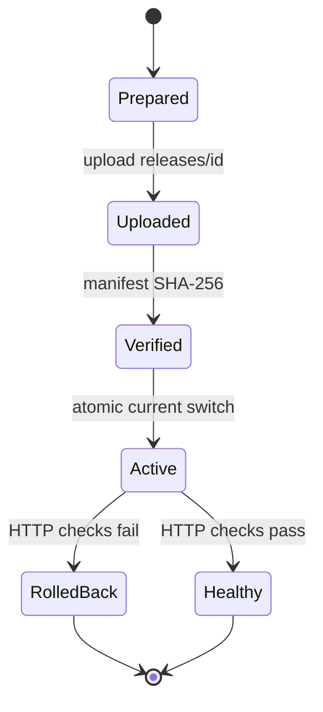

# TSSKB 2.x 架构

## 目标与边界

TSSKB 2.x 是“静态运行时、平台化供应链”的知识内容平台。它解决以下工程问题：

- 课程数据不再硬编码在 Python 中；
- 配置、Markdown、模板、样式和交互各自有单一所有者；
- 构建前校验来源，构建后校验每条内部链接、锚点和资源；
- 搜索容量可以量化和设预算；
- 发布不会先删除线上目录，并可自动回滚；
- 每个输出文件能够追溯到输入与摘要。

不在本阶段实现登录、收藏、学习进度和数据库 CMS。需要在线状态时，应先通过 ADR 证明收益大于运行复杂度。

## 系统上下文


## 构建分层

```text
content/*.json + books/** + static/** + templates/**
                         │
                         ▼
ContentRepository ── Pydantic + cross-reference validation
                         │
                         ▼
BuildPlanner ─────── global/course SHA-256 change plan
                         │
                         ▼
PageRenderer ─────── Jinja2 StrictUndefined + autoescape
MarkdownRenderer ─── controlled Markdown transformations
                         │
                         ▼
SearchBuilder ────── title index + bounded category shards
ManifestWriter ───── input/output digests + provenance
SiteValidator ────── links + anchors + assets + template leaks
```

模块边界：

- `content/loader.py` 只负责将外部输入变成合法领域对象；
- `models.py` 是内容契约唯一所有者；
- `build/renderer.py` 是 HTML 模板执行边界；
- `build/pipeline.py` 只做编排，不保存课程数据或 CSS；
- `build/search.py` 拥有搜索文件格式和容量统计；
- `deploy/transport.py` 只负责远端传输和原子切换；
- `deploy/release.py` 拥有发布状态机和失败补偿。

## 数据契约

`content/catalog.json` 的课程必须声明稳定 ID、分类、书籍、状态、版本、页数、角色、难度、标签、学习路线、技能分组和来源验证日期。`ContentRepository` 还会检查：

- ID、分类和技能 slug 合法且无重复；
- `books/<book>` 和三份课程长文存在；
- 每个技能对应 `books/<book>/<skill>/SKILL.md`；
- 学习路径只指向已生成课程；
- 重定向不覆盖现有页面，目标必须存在。

JSON Schema 是对外合同，Pydantic 模型是运行时合同；契约测试保证两者同步。

## 可复现与增量构建

全局摘要由配置、schema、模板、静态资源、工程配置和构建器源码计算；课程摘要再叠加该课程目录和课程模型。这样构建逻辑本身发生变化时也会强制重建全部课程，单门课程输入变化时则只重建该课程。首页、分类、搜索和 manifest 始终重新计算，以避免派生数据陈旧。

`_meta/manifest.json` 不包含构建时间。它记录 Git revision、input/output digest、每个输出文件的大小和 SHA-256、页面到输入文件的 provenance，以及搜索容量指标。有波动的时间和耗时单独写入 `_meta/build-metrics.json`，不参与可复现摘要。

## 发布状态机



远端 Release 目录不可变。切换动作只更新 `current` 软链接；故障补偿只恢复上一软链接，不删除当前或历史版本。
正常发布和手工回滚使用同一健康检查合同；检查不仅验证首页、搜索、课程和品牌资源，还必须从 `_meta/release-manifest.json` 读到预期 `release_id`，防止旧服务返回 200 造成假成功。如果回滚目标不健康，系统会再次切回执行回滚前的当前版本，避免“回滚动作”本身扩大故障。

## 安全模型

- 配置字段由 Jinja2 自动转义，模板使用 `StrictUndefined`；
- Markdown 是受 Git/评审控制的可信输入，不接受匿名在线提交；
- CSP、安全头和 MIME 嗅探保护由 Nginx 配置提供；
- SSH 拒绝未知主机，凭据不记录、不入 manifest；
- 输出为静态文件，没有数据库、会话和服务端执行入口。

## 演进点

- 多人非技术运营：先增加 PR 表单和预览环境，再评估 Headless CMS；
- 内容超过当前容量 5 倍：考虑预构建倒排索引或 WASM 搜索；
- 需要学习状态：新增独立身份/进度服务，不污染静态内容发布链；
- 多站点/多语言：在领域模型增加 locale 与 site_id，保持模板和内容分层。
